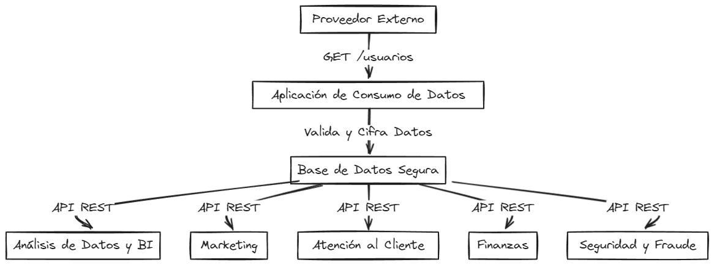

# Security Challenge 2022

## Descripción de la Aplicación
Esta aplicación es una API diseñada para manejar de manera segura la recepción, almacenamiento y distribución de información sensible de los clientes obtenida a través de un endpoint externo. Utiliza Flask como framework de servidor, MongoDB para el almacenamiento de datos y cifrado de datos sensibles con Fernet para garantizar la seguridad durante el tránsito y el almacenamiento.

### Supuestos
- La API maneja datos sensibles y debe garantizar la seguridad en todos los estados.
- La información sensible debe estar cifrada en todo momento, excepto durante el procesamiento en memoria.

### Problemas y Soluciones
- **Problema**: Riesgo de exposición de datos sensibles durante el tránsito.
  - **Solución**: Cifrado de datos sensibles antes de su almacenamiento y aseguramiento de las comunicaciones con TLS.
- **Problema**: Necesidad de acceder a diferentes tipos de datos según el departamento de la empresa.
  - **Solución**: Implementación de roles en JWT que limitan el acceso a los datos según las necesidades del departamento.

### Evidencias

*Captura de pantalla del funcionamiento de la API. Usando el rol del departamento de Seguridad y el Id = 100*

## Instrucciones de Ejecución

### Requisitos Previos
- Python 3.8 o superior
- MongoDB
- Dependencias de Python listadas en `requirements.txt`

### Instalación de Dependencias
Instalar las dependencias necesarias ejecutando:
```bash
pip install -r requirements.txt
```

### Configuración de Variables de Entorno
Configurar el archivo `.env.example` a archivo .env en el directorio raíz del proyecto y actualizar las siguientes variable:

* `JWT_SECRET_KEY`: Clave secreta para JWT.
* `MONGO_URI`: URI de conexión a MongoDB.
* `ENCRYPTION_KEY`: Clave para el cifrado Fernet.

### Ejecución de la Aplicación
#### Ejecución local

Para ejecutar la aplicación localmente, sigue estos pasos:

1. Levantar la base de datos MongoDB:
Asegúrate de que MongoDB esté en funcionamiento con los siguientes comandos:

```bash
mongod --dbpath /data/db --logpath /var/log/mongodb/mongod.log
```

2. Levantar servidor ngrok (opcional):
Si deseas exponer tu aplicación a través de ngrok para pruebas o puedes usar el puerto `5000` en local:

```bash
ngrok http 5000
```

3. Ejecutar la aplicación:
Ejecuta la aplicación Flask:

```bash
python3 app.py
```

## Comunicación con la API
### Acceso
Para obtener un token de acceso:

```bash
curl -X POST https://18ad-190-221-146-98.ngrok-free.app/login \
    -H "Content-Type: application/json" \
    -d '{"username": "<ROLE>", "password": "<KEY_USER>"}'
```

### Fetch Data
Para obtener y almacenar datos desde el proveedor externo (permitido solo para el admin):

```bash
curl -X GET -H "Authorization: Bearer <your_token>" https://d46c-190-221-146-98.ngrok-free.app/fetch-data
```

### Obtener la Data Encriptada
Para obtener todos los datos de usuarios encriptados:

```bash
curl -X GET -H "Authorization: Bearer <your_token>" https://d46c-190-221-146-98.ngrok-free.app/usuarios/
```

Para obtener datos de un usuario específico por ID:
```bash
curl -X GET -H "Authorization: Bearer <your_token>" https://d46c-190-221-146-98.ngrok-free.app/usuarios/<ID>
```


### Análisis de Riesgo de la Solución Planteada

* *Riesgo de filtración de datos*: Alto. Si las claves de cifrado son expuestas. Se recomienda rotar regularmente las claves y almacenarlas de manera segura.
* *Riesgo de acceso no autorizado*: Medio. Aunque se utiliza JWT para la autenticación, la configuración y manejo de los tokens debe ser rigurosa para evitar explotaciones.
* *Riesgo de ataques de inyección*: Bajo. Se utiliza validación de esquemas para evitar inyecciones no deseadas en la base de datos.

#### Arquitectura de la Aplicación

Diagrama de arquitectura mostrando cómo los componentes interactúan entre sí y con los servicios externos.



Explicación del Diagrama:

* Proveedor Externo: Fuente de datos externa que proporciona la información de los usuarios. 
* Aplicación de Consumo de Datos: Tu aplicación que consume los datos desde el proveedor externo.
* Base de Datos Segura: Almacena los datos cifrados y procesados de manera segura.
* Aplicaciones Internas: Aplicaciones dentro de la empresa que consumen los datos a través de la API REST


### Explicación del Procedimiento Paso a Paso
#### Objetivo
Dado el contexto otorgado, realicé un análisis de cómo consumir y posteriormente almacenar estos datos de datos no relacional de manera segura. Además, disponibilicé esta información para que distintos departamentos y aplicaciones de la empresa pudieran consumirla, teniendo en cuenta cada uno de los atributos que vienen desde este proveedor. Se realizaron los controles necesarios para asegurar esta información, estableciendo el tipo de control, la forma de obtener los datos y los posibles consumidores.

#### Procedimiento
1. Recepción de Datos:

* Se implementó un endpoint /fetch-data que consume datos de un proveedor externo. Solo el admin tiene acceso.
* Los datos recibidos son validados utilizando cerberus.

2. Cifrado de Datos Sensibles:

* Los datos sensibles como `credit_card_num`, `credit_card_ccv`, `cuenta_numero`, `direccion`, `foto_dni`, e `ip` son cifrados utilizando cryptography.fernet.Fernet antes de ser almacenados en MongoDB.

3. Almacenamiento Seguro:

* Los datos validados y cifrados son almacenados en una base de datos MongoDB.

4. Distribución de Datos:

* Se implementaron roles utilizando JWT para asegurar que solo los usuarios autorizados puedan acceder a los datos.
* Se definieron roles específicos para cada departamento (BI, Marketing, Atención al Cliente, Finanzas, Seguridad y Fraude) con acceso limitado a ciertos campos de los datos.

5. Seguridad de la API:

* Se asegura que todas las comunicaciones con la API se realizan sobre HTTPS para proteger los datos en tránsito.
* Se implementó autenticación basada en JWT para proteger los endpoints.

6. Acceso a Datos por Roles:

Se implementó la lógica en el endpoint `/usuarios` y `/usuarios/<user_id>`  para devolver datos filtrados según el rol del usuario autenticado.

#### Conclusión
Esta solución garantiza que los datos sensibles de los clientes sean manejados y almacenados de manera segura, cumpliendo con los requisitos de acceso específico para diferentes departamentos dentro de la empresa. Además, se implementaron medidas de seguridad robustas para proteger los datos en tránsito y asegurar que solo los usuarios autorizados tengan acceso a la información según su rol.


### A Implementar 

*Creación de copias de seguridad automatizadas de MongoDB*

En la sección script/backup_mongodb.sh se encuentra un script para la implementación de una tarea cron que actualiza automáticamente el backup de la base de datos a intervalos regulares.


Este README proporciona una guía completa sobre cómo configurar y utilizar la aplicación, incluyendo ejemplos de cómo los diferentes departamentos pueden interactuar con la API utilizando `curl` y Postman.
